# ⚖️ 법무법인 신세계로 — 프리미엄 로펌 웹사이트 리뉴얼

<p align="center">
  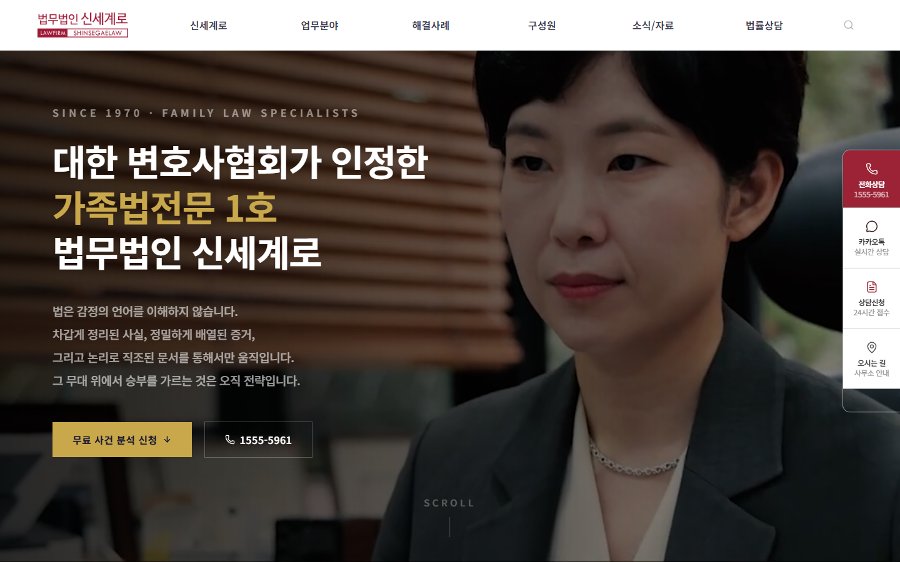
</p>

<p align="center">
  <strong>52년 법조 전통, 22인의 이혼·상속 전문 변호사 — 프리미엄 로펌 웹사이트</strong><br/>
  기존 사이트(shinsegaelaw.kr)를 완전히 새로운 디자인으로 리뉴얼한 풀스택 웹 프로젝트
</p>

<p align="center">
  
  
  
  
  
  
</p>

<p align="center">
  <a href="http://3.39.246.25:5173/">🌐 Live Demo</a> ·
  <a href="#-주요-기능">📋 Features</a> ·
  <a href="#-기술-스택">🛠️ Tech Stack</a> ·
  <a href="#-프로젝트-구조">📁 Architecture</a>
</p>

---

## 📑 목차

| # | 섹션 | 설명 |
|---|------|------|
| 1 | [📋 프로젝트 정보](#-프로젝트-정보) | 개발 기간, 인원, 규모 |
| 2 | [🎬 서비스 시연](#-서비스-시연) | 데스크톱/모바일 스크린샷 30장+ |
| 3 | [🎯 프로젝트 배경](#-프로젝트-배경-및-목표) | 문제 정의, 솔루션, 레퍼런스 |
| 4 | [🛠️ 기술 스택](#-기술-스택-tech-stack) | Frontend, UI, DevOps, Data |
| 5 | [📌 주요 기능](#-주요-기능) | 14개 핵심 기능 테이블 |
| 6 | [🔄 아키텍처](#-시스템-아키텍처) | 시스템 흐름도 |
| 7 | [📁 프로젝트 구조](#-프로젝트-구조) | 디렉토리 트리 + 파일 설명 |
| 8 | [🎨 디자인 시스템](#-디자인-시스템) | 컬러, 타이포, 애니메이션, 레이아웃 |
| 9 | [📄 페이지 상세](#-페이지-상세) | 메인 7섹션 + 서브 26개 |
| 10 | [📊 데이터 크롤링](#-데이터-크롤링-실적) | 4,300건 크롤링 + 정합성 검증 |
| 11 | [🔄 경쟁사 분석](#-경쟁사-분석-및-차별화) | YK/대륜 비교표 |
| 12 | [⚙️ 설치 및 실행](#-설치-및-실행) | 로컬 개발 환경 세팅 |
| 13 | [🚀 배포](#-배포) | AWS EC2 구성 |
| 14 | [📈 성과 지표](#-성과-지표) | 달성 현황 |
| 15 | [💡 차별점](#-프로젝트-차별점) | 5가지 핵심 차별점 |

---

## 📋 프로젝트 정보

| 항목 | 내용 |
|------|------|
| **프로젝트명** | 법무법인 신세계로 웹사이트 리뉴얼 |
| **개발 기간** | 2026년 2월 ~ 4월 (약 8주) |
| **개발 인원** | 1명 (풀스택) |
| **담당 역할** | 기획 · 디자인 · 프론트엔드 · 데이터 크롤링 · 서버 배포 전 과정 |
| **페이지 수** | 메인 1개 + 서브페이지 26개 + 동적 라우트 다수 |
| **데이터 규모** | 승소사례 1,053건 · 언론기사 1,010건 · 칼럼 637건 · 유튜브 451개 · 쇼츠 553개 |
| **배포 환경** | AWS EC2 (PM2 + Next.js Production) |
| **라이브 URL** | [http://3.39.246.25:5173/](http://3.39.246.25:5173/) |

---

## 🎬 서비스 시연

 [https://ssgl.blogcash.kr/](https://ssgl.blogcash.kr/) |


---

### 공통 UI 컴포넌트

<p align="center">
  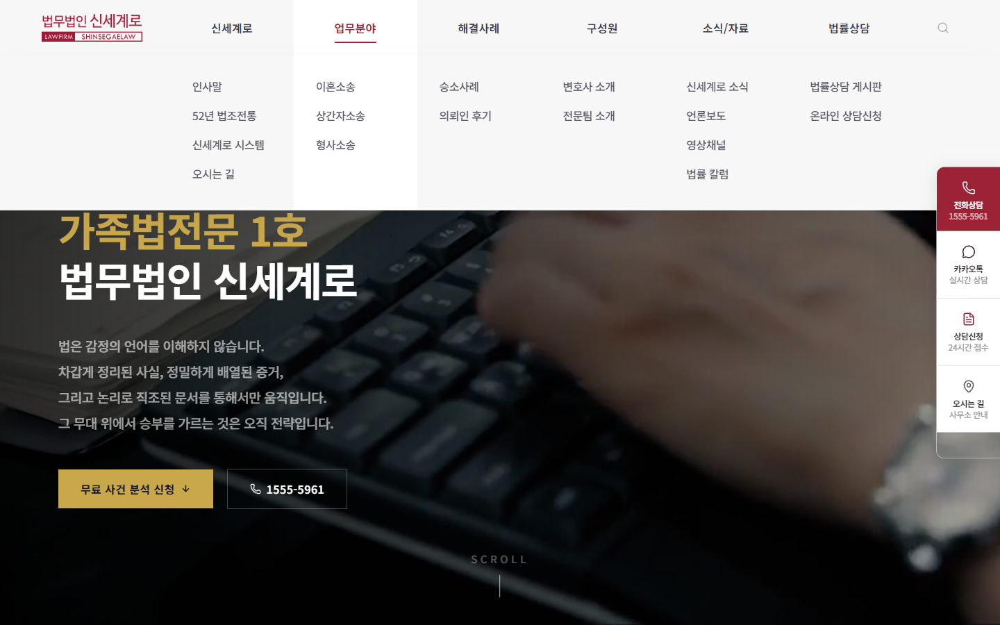<br/>
  <em>5탭 프리미엄 메가메뉴 — 글래스모피즘 + stagger 애니메이션</em>
</p>

<p align="center">
  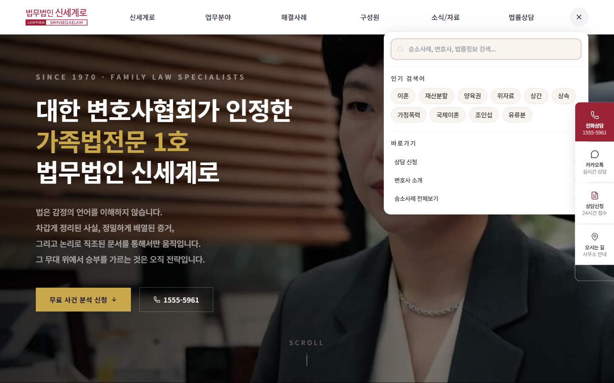<br/>
  <em>글로벌 검색 — 2,188건 실시간 검색 + 카테고리 그룹핑 + 인기 태그</em>
</p>

<p align="center">
  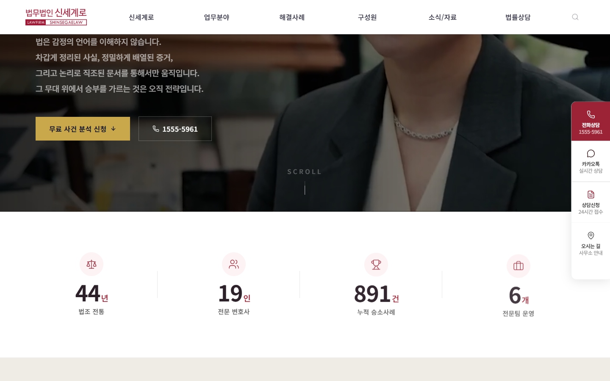<br/>
  <em>FloatingCTA — 전화/카카오톡/상담/오시는길 4개 액션 사이드바</em>
</p>

---

### 모바일 반응형

<p align="center">
  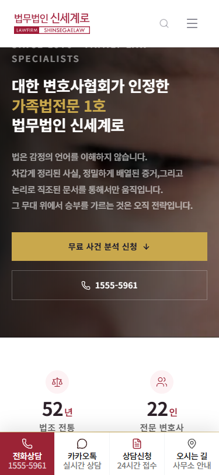
  &nbsp;
  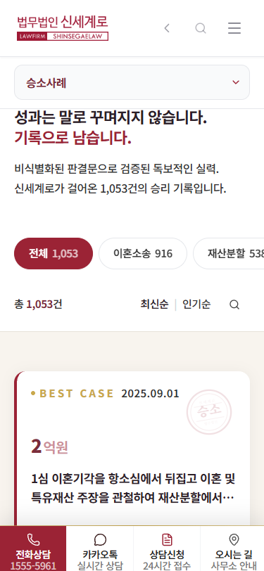
  &nbsp;
  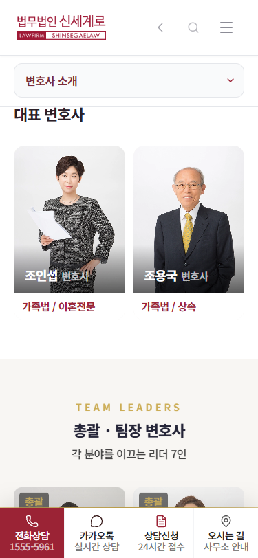
  &nbsp;
  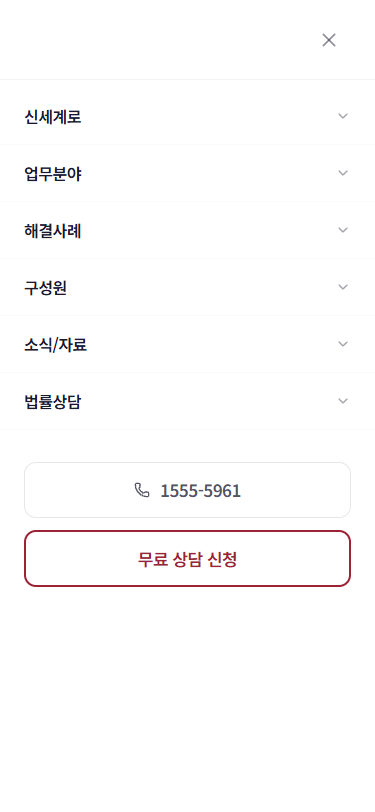
</p>
<p align="center"><em>모바일 — Hero / 승소사례 / 변호사 2열 그리드 / 풀스크린 메뉴</em></p>

<p align="center">
  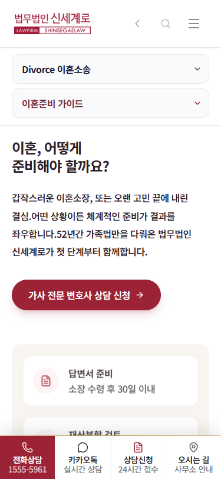
  &nbsp;
  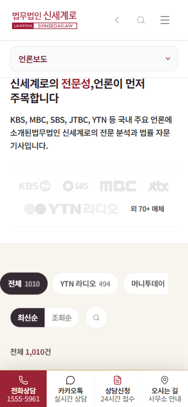
  &nbsp;
  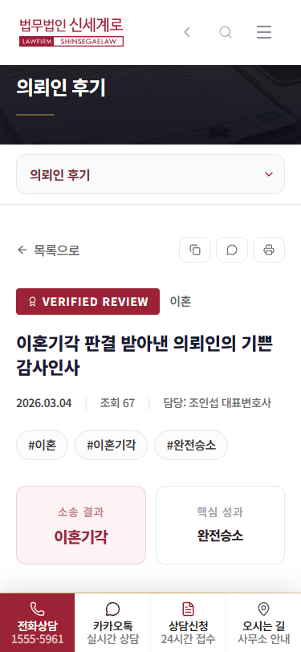
  &nbsp;
  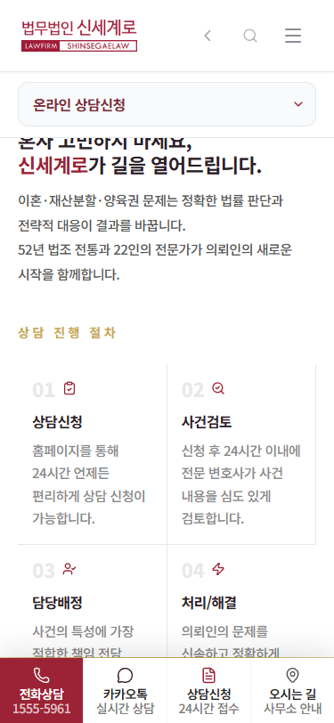
</p>
<p align="center"><em>모바일 — 업무분야 / 언론보도 / 후기 상세 / 상담 + 하단 CTA 바</em></p>

---

## 🎯 프로젝트 배경 및 목표

### 문제 정의
- ❌ 기존 사이트(shinsegaelaw.kr)는 2000년대 디자인으로 노후화
- ❌ 모바일 미대응, 접근성 부족, SEO 미적용
- ❌ 경쟁 로펌(YK, 대륜) 대비 디지털 프레즌스 열위
- ❌ 1,053건 승소사례, 1,010건 언론보도 등 방대한 콘텐츠 비활용

### 솔루션
> **"해외 프리미엄 로펌(kirkland.com, skadden.com) 수준의 디자인 + 국내 경쟁사 압도 콘텐츠"**

기존 사이트 데이터 전수 크롤링 → Next.js 14 기반 프리미엄 리뉴얼 → 모바일/SEO/접근성 완전 대응

### 디자인 레퍼런스
| 분류 | 레퍼런스 | 참고 요소 |
|------|---------|----------|
| **해외 로펌** | kirkland.com, skadden.com, wlrk.com | 프리미엄 톤, serif 타이포, 다크/라이트 교차 |
| **국내 기업** | doosan.com/kr, embrain.com | 스크롤 애니메이션, 시네마틱 히어로 |
| **국내 로펌** | YK법률사무소, 대륜법무법인 | 경쟁사 분석 후 차별화 |

---

## 🛠️ 기술 스택 (Tech Stack)

### **Frontend**
| 기술 | 버전 | 용도 |
|------|------|------|
| **Next.js** | 14.2 | App Router, RSC, SSR/SSG |
| **TypeScript** | 5.0 | 타입 안전성 |
| **Tailwind CSS** | 3.4 | 유틸리티 기반 스타일링 + tailwindcss-animate |
| **Radix UI** | Latest | 접근성 준수 헤드리스 컴포넌트 (Dialog, Tabs, Select) |
| **Framer Motion** | 12 | 서브페이지 애니메이션, AnimatePresence |

### **UI/UX**
| 기술 | 용도 |
|------|------|
| **Swiper** | 메인 캐러셀 (승소사례, 변호사, 후기) |
| **Embla Carousel** | 커스텀 캐러셀 (자동 재생, 루프) |
| **Lucide React** | 200+ 아이콘 시스템 |
| **CountUp.js** | 숫자 카운트업 애니메이션 |
| **GSAP** | 메인 ScrollTrigger 애니메이션 |

### **Font & Design**
| 항목 | 값 |
|------|-----|
| **본문** | Pretendard (가변 웹폰트 CDN) |
| **헤드라인** | Gowun Batang (명조체, next/font) |
| **필기체** | Dancing Script (Hero 장식) |
| **서명** | Nanum Pen Script |

### **DevOps & Deployment**
| 기술 | 용도 |
|------|------|
| **AWS EC2** | 프로덕션 서버 (Ubuntu) |
| **PM2** | Node.js 프로세스 매니저 |
| **GitHub** | 버전 관리 + CI/CD |

### **Data & Crawling**
| 기술 | 용도 |
|------|------|
| **Node.js Scripts** | 원본 사이트 데이터 크롤링 |
| **JSON** | 정적 데이터 레이어 (API 없이 빌드 타임 import) |

---

## 📌 주요 기능

| 기능 | 설명 | 핵심 기술 |
|------|------|----------|
| **시네마틱 히어로** | 영상 배경 + 순차 텍스트 등장 + 골드 악센트 CTA | CSS keyframe, IntersectionObserver |
| **프리미엄 메가메뉴** | 5탭 글래스모피즘 드롭다운 + stagger 애니메이션 | Radix UI, CSS backdrop-filter |
| **승소사례 검색** | 1,053건 필터/검색/정렬/페이지네이션 + 금액 하이라이트 | Client-side search, URL state |
| **변호사 프로필** | 22명 그리드 + 개별 상세(4탭: 활동/학력/사례/후기) | Dynamic routing `[id]` |
| **전문팀 시스템** | 7개 팀 상세 + 팀장 프로필 + 프로세스 + 대표 사례 | Dynamic routing `[slug]` |
| **업무분야 랜딩** | 14개 커스텀 랜딩 페이지 (이혼/위자료/양육권 등) | 개별 섹션 구성 |
| **언론보도** | 1,010건 + YouTube 임베드 매핑 (487개) | press_youtube_ids.json |
| **영상채널** | YouTube 451개 + Shorts 553개 + 웹툰 5화 통합 | Swiper, lazy loading |
| **법률칼럼** | 637건 + 콘텐츠 파서 (이미지 인터리빙, 인용 감지) | Custom parser |
| **글로벌 검색** | 2,188건 실시간 검색 + 카테고리 그룹핑 | 200ms debounce, client-side |
| **반응형 디자인** | 375px ~ 1920px 완전 대응 + 터치 최적화 | Tailwind responsive, 44px touch |
| **SEO 최적화** | generateMetadata + JSON-LD + OG 태그 | Next.js App Router |
| **접근성** | skip-to-content, aria-label, WCAG AA 대비 | prefers-reduced-motion |
| **스크롤 애니메이션** | IO 기반 reveal + stagger + 카운트업 | SSR-safe, 네이티브 IO |

---

## 🔄 시스템 아키텍처

```
사용자 요청 (브라우저)
│
├─ Next.js 14 App Router (SSR/SSG)
│   ├─ 메인 페이지 ── 7개 섹션 (ScrollReveal 애니메이션)
│   ├─ 서브페이지 ── 26개 (Framer Motion 전환)
│   └─ 동적 라우트 ── [id], [slug] (generateMetadata)
│
├─ 데이터 레이어 (JSON Import, 빌드 타임)
│   ├─ cases_all.json ──── 1,053건 승소사례
│   ├─ press.json ──────── 1,010건 언론기사
│   ├─ columns.json ────── 637건 법률 칼럼
│   ├─ reviews.json ────── 90건 의뢰인 후기
│   ├─ lawyers.json ────── 22명 변호사 프로필
│   ├─ teams.json ──────── 7개 전문팀
│   └─ youtube/shorts.json ── 1,004개 영상
│
├─ UI 컴포넌트 시스템
│   ├─ layout/ ──── Header(메가메뉴), Footer, FloatingCTA
│   ├─ sections/ ── Hero, CEO, Cases, Lawyers, Reviews, ContactCTA
│   ├─ shared/ ──── Tabs(6종), SubPageHero, MobileCTA, SearchDropdown
│   └─ templates/ ─ PracticePageLayout, PlaceholderPage
│
└─ 배포 (AWS EC2)
    ├─ PM2 프로세스 매니저 (포트 5173)
    ├─ Next.js Production Build
    └─ GitHub → EC2 수동 배포 (tar.gz 패키지)
```

---

## 📁 프로젝트 구조

```
shinsegaela_website/
│
├── 📂 data/                          # 크롤링된 JSON 데이터 (원본)
│   ├── 📜 lawyers.json               # 변호사 22명 (프로필, 경력, 학력, 소개)
│   ├── 📜 cases_all.json             # 승소사례 1,053건 (5카테고리, 이미지 1,488개)
│   ├── 📜 cases_crawled_full.json    # 승소사례 원본 전문 아카이브
│   ├── 📜 reviews.json               # 의뢰인 후기 90건 (이미지, 답변 33건)
│   ├── 📜 press.json                 # 언론기사 1,010건 (6개 매체)
│   ├── 📜 press_youtube_ids.json     # YTN 라디오 YouTube ID 487개 매핑
│   ├── 📜 columns.json               # 법률 칼럼 637건 (이미지 1,818장)
│   ├── 📜 youtube.json               # YouTube 451개 (2채널)
│   ├── 📜 shorts.json                # Shorts 553개
│   ├── 📜 teams.json                 # 7개 전문팀 (프로세스, 대표사례)
│   ├── 📜 firm_info.json             # 법인정보, 3개 사무소
│   ├── 📜 greeting.json              # 인사말 데이터
│   ├── 📜 tradition.json             # 52년 법조전통 데이터
│   ├── 📜 news.json                  # 뉴스 13개
│   └── 📜 faq.json                   # FAQ 10개
│
├── 📂 frontend/                       # Next.js 14 App
│   ├── 📂 src/
│   │   ├── 📂 app/                   # 페이지 라우트 (App Router)
│   │   │   ├── 📜 page.tsx           # 메인 (7개 섹션 + DotNavigation)
│   │   │   ├── 📜 layout.tsx         # Root Layout (메타데이터, 폰트)
│   │   │   ├── 📜 globals.css        # Tailwind + 커스텀 CSS 변수
│   │   │   │
│   │   │   ├── 📂 about/             # 신세계로 소개
│   │   │   │   ├── greeting/         #   인사말 (대표 2명)
│   │   │   │   ├── tradition/        #   52년 법조전통
│   │   │   │   ├── system/           #   신세계로 시스템
│   │   │   │   ├── location/         #   오시는 길 (Google Maps)
│   │   │   │   ├── lawyers/          #   변호사 22명 + [id] 상세
│   │   │   │   └── teams/[slug]/     #   7개 전문팀 상세
│   │   │   │
│   │   │   ├── 📂 cases/             # 승소사례
│   │   │   │   ├── page.tsx          #   목록 (필터/검색/페이지네이션)
│   │   │   │   └── [id]/             #   상세 (라이트박스, 공유/인쇄)
│   │   │   │
│   │   │   ├── 📂 practice/          # 업무분야 (14개 랜딩)
│   │   │   │   ├── divorce/          #   이혼소송 10개
│   │   │   │   ├── adultery/         #   상간자소송 3개
│   │   │   │   └── criminal/         #   형사소송 1개
│   │   │   │
│   │   │   ├── 📂 reviews/           # 의뢰인 후기
│   │   │   ├── 📂 press/             # 언론보도 1,010건
│   │   │   ├── 📂 news/              # 신세계로 소식
│   │   │   ├── 📂 media/             # 미디어
│   │   │   │   ├── channel/          #   YouTube+Shorts+웹툰 통합
│   │   │   │   └── column/           #   법률 칼럼 637건 + [id]
│   │   │   └── 📂 consultation/      # 상담신청 + 게시판
│   │   │
│   │   ├── 📂 components/
│   │   │   ├── 📂 layout/            # Header, Footer, FloatingCTA
│   │   │   ├── 📂 sections/          # 메인 페이지 7개 섹션
│   │   │   ├── 📂 shared/            # 공용 컴포넌트 (탭 6종, 검색 등)
│   │   │   ├── 📂 templates/         # 페이지 템플릿 (Practice, Placeholder)
│   │   │   └── 📂 ui/                # 기본 UI (DotNavigation 등)
│   │   │
│   │   ├── 📂 hooks/                 # 커스텀 훅 (useScrollReveal)
│   │   └── 📂 lib/                   # 유틸리티 (constants, motion, utils)
│   │
│   ├── 📂 public/
│   │   ├── 📂 images/                # 정적 이미지
│   │   │   ├── attorneys/            #   변호사 프로필 22개
│   │   │   ├── office/               #   사무실, 배너 7개
│   │   │   ├── reviews/              #   후기 이미지 90개
│   │   │   ├── columns/              #   칼럼 이미지 1,818장
│   │   │   ├── practice/             #   업무분야 이미지 11개
│   │   │   └── system/               #   시스템 이미지 18개
│   │   └── 📂 videos/                # hero-bg.mp4
│   │
│   ├── 📜 tailwind.config.js         # 디자인 토큰 (버건디/골드/네이비)
│   ├── 📜 next.config.mjs            # 리다이렉트 19개 + 캐시 설정
│   └── 📜 tsconfig.json              # TypeScript 설정
│
├── 📂 scripts/                        # 크롤링 스크립트
│   └── 📜 crawl_press_youtube_ids.js  # YTN YouTube ID 487개 크롤링
│
└── 📜 CLAUDE.md                       # AI 페어 프로그래밍 컨텍스트
```

---

## 🎨 디자인 시스템

### 컬러 팔레트

| 용도 | 컬러 | HEX | 적용 |
|------|------|-----|------|
| 🔴 **Primary** | Burgundy | `#9B2335` | CTA, 활성 탭, 강조 텍스트 |
| 🟡 **Accent** | Gold | `#C9A84C` | 숫자, 아이콘, 디바이더 |
| ⚫ **Text** | Dark | `#2C2028` | 헤드라인 |
| ⚫ **Body** | Medium | `#333333` | 본문 텍스트 |
| 🟤 **Warm BG** | Cream | `#F8F4EE` | 교차 배경 |
| ⚪ **Light BG** | White | `#FFFFFF` | 기본 배경 |

### 타이포그래피

```
헤드라인:  Gowun Batang (명조체) — 전문적이고 클래식한 인상
본문:      Pretendard (고딕) — 가독성 최적화, 가변 웹폰트
장식:      Dancing Script — Hero 필기체 악센트
서명:      Nanum Pen Script — 인사말 서명 영역
```

### 애니메이션 시스템

| 영역 | 방식 | 상세 |
|------|------|------|
| **메인 섹션** | ScrollReveal (IO) | translateY(80px) + 0.7s easeOutQuart, SSR-safe |
| **서브페이지** | Framer Motion | AnimatePresence + stagger 카드 등장 |
| **Hero** | CSS Keyframe | heroFadeUp 순차 등장 (0.3s ~ 1.5s) |
| **CEO 사진** | clip-path | polygon 좌→우 와이프 (1.2s, embrain 스타일) |
| **카드 호버** | Tailwind | -translate-y-2 + shadow-lg + duration-500 |
| **메가메뉴** | CSS Transition | opacity + translateY(-8→0) 0.2s |
| **숫자 카운트** | useCountUp (IO) | 네이티브 IntersectionObserver 기반 |

### 레이아웃 규칙

```
섹션 여백:     py-20 md:py-28 lg:py-36
컨테이너:      max-w-7xl mx-auto px-6 md:px-8
카드 둥글기:   rounded-2xl (16px)
배경 교차:     white → #F8F4EE → white → #F8F4EE (리듬감)
터치 타겟:     최소 44×44px (WCAG 2.1 AA)
```

---

## 📄 페이지 상세

### 메인 페이지 (7개 섹션)

```
┌──────────────────────────────────────────────┐
│  🎬 Hero                                     │
│  시네마틱 영상 배경 + 순차 텍스트 + CTA pill  │
├──────────────────────────────────────────────┤
│  📊 TrustIndicators                          │
│  52년 · 22인 · 1,053건+ · 7개팀 카운트업     │
├──────────────────────────────────────────────┤
│  👤 CEO Section                              │
│  대표변호사 사진 + clip-path reveal + 인용문  │
├──────────────────────────────────────────────┤
│  🏆 Cases                                    │
│  승소사례 Swiper 카드 + 도장 씰 + 금액 강조  │
├──────────────────────────────────────────────┤
│  👥 Lawyers                                  │
│  대표 2명 대형카드 + 나머지 Swiper 캐러셀    │
├──────────────────────────────────────────────┤
│  💬 Reviews                                  │
│  의뢰인 후기 자동 슬라이드 + 결과 뱃지       │
├──────────────────────────────────────────────┤
│  📞 Contact CTA                              │
│  6-Step 프로세스 + 검색 태그 + 안심 뱃지     │
└──────────────────────────────────────────────┘
+ 🔵 DotNavigation (우측 세로 7개)
+ 📱 FloatingCTA (전화/카카오톡/상담/오시는길)
```

### 서브페이지 구성 (26개 실제 콘텐츠)

| 카테고리 | 페이지 | 핵심 기능 |
|---------|--------|----------|
| **신세계로** | 인사말, 제1호, 52년전통, 시스템, 오시는길 | 4탭 네비게이션, Google Maps, 카운트업 |
| **변호사** | 22명 목록 + 개별 상세 | 4열 그리드, 호버 오버레이, 4탭 프로필 |
| **전문팀** | 7개 팀 상세 | 동적 라우팅, 팀별 프로세스/대표사례 |
| **승소사례** | 목록 + 상세 | 1,053건, 금액 하이라이트, 라이트박스 |
| **의뢰인후기** | 목록 + 상세 | 90건, 법무법인 답변, 이미지 갤러리 |
| **업무분야** | 14개 커스텀 랜딩 | 2단 탭, 페이지별 고유 섹션 구성 |
| **언론보도** | 목록 + 상세 | 1,010건, YouTube 487개 매핑, 매체별 필터 |
| **영상채널** | 통합 페이지 | YouTube 451 + Shorts 553 + 웹툰 5화 |
| **법률칼럼** | 목록 + 상세 | 637건, 콘텐츠 파서, 이미지 인터리빙 |
| **상담** | 상담신청 + 게시판 | 2탭, 폼 유효성 검사, FAQ 아코디언 |

---

## 📊 데이터 크롤링 실적

원본 사이트(shinsegaelaw.kr)에서 **전수 크롤링**하여 데이터 무결성 확보:

| 데이터 | 건수 | 상세 |
|--------|------|------|
| **승소사례** | 1,053건 | 5카테고리(이혼555/재산261/상간112/양육88/상속37), 이미지 1,488개 |
| **언론기사** | 1,010건 | 6개 매체(YTN494/머니투데이101/아이뉴스24_85/뉴스1_65/파이낸셜44/기타221) |
| **법률칼럼** | 637건 | 이미지 1,818장 로컬 저장, 푸터 오염 전수 정제 (124만자 제거) |
| **YouTube** | 451개 | 2채널, 제목+날짜+썸네일 전수 확보 |
| **Shorts** | 553개 | 70페이지 전수 크롤링, 날짜 99.5% 확보 |
| **YouTube ID** | 487개 | YTN 라디오 기사별 실제 영상 매핑 |
| **변호사** | 22명 | 프로필, 경력, 학력, 소개글 |
| **전문팀** | 7개 | 전문분야, 프로세스, 대표사례(details) |
| **의뢰인후기** | 90건 | 이미지, 법무법인 답변 33건 |

### 데이터 정합성 검증

```
✅ 칼럼 637건 — 제목/내용/날짜 누락: 0건
✅ 칼럼 이미지 1,818개 — 파일 누락: 0건
✅ 쇼츠 553개 — 빈 제목: 0건, 중복: 0건
✅ 유튜브 451개 — 제목 전수 확보
✅ 승소사례 500자 잘림 23건 — 전문 재크롤링 완료
✅ 변호사 누락 141건 — 복원 완료
✅ Zero-width 문자 — 전수 제거
```

---

## 🔄 경쟁사 분석 및 차별화

### 경쟁사 비교

| 항목 | YK법률사무소 | 대륜법무법인 | **신세계로 (본 프로젝트)** |
|------|------------|------------|------------------------|
| CEO 섹션 | ❌ 없음 | ❌ 없음 | ✅ serif+photo+quote (해외 로펌 스타일) |
| 명조체 | ❌ sans-serif만 | ❌ sans-serif만 | ✅ Gowun Batang 헤드라인 |
| 골드 악센트 | ❌ 없음 | ❌ 없음 | ✅ #C9A84C 전면 적용 |
| 스크롤 애니메이션 | ⚠️ 기본 | ⚠️ 기본 | ✅ embrain급 ScrollReveal |
| 승소사례 금액 | ⚠️ 텍스트만 | ⚠️ 텍스트만 | ✅ 금액 히어로 (28~52px 강조) |
| 모바일 최적화 | ⚠️ 기본 | ⚠️ 기본 | ✅ 터치 44px, 하단 고정 바 |
| 콘텐츠 규모 | - | - | ✅ 4,300+ 건 데이터 |

---

## ⚙️ 설치 및 실행

### 필수 요구사항
- Node.js 18 이상
- npm 9 이상

### Step 1: 저장소 클론
```bash
git clone https://github.com/minseo3280-coder/shinsegaelaw-website.git
cd shinsegaelaw-website
```

### Step 2: 의존성 설치
```bash
cd frontend
npm install
```

### Step 3: 개발 서버 실행
```bash
npm run dev
```

**출력 예시:**
```
▲ Next.js 14.2.35
- Local:    http://localhost:3000
- Ready in 2.8s
```

### Step 4: 프로덕션 빌드
```bash
npm run build    # 프로덕션 빌드
npm run start    # 프로덕션 서버 실행
```

---

## 🚀 배포

### AWS EC2 배포 구성

```
┌─────────────────────────────────┐
│  AWS EC2 (Ubuntu)               │
│  IP: 3.39.246.25                │
│                                 │
│  ┌───────────────────────────┐  │
│  │  PM2 Process Manager      │  │
│  │  ├─ shinsegae (포트 5173) │  │
│  │  └─ Next.js Production    │  │
│  └───────────────────────────┘  │
│                                 │
│  /home/ubuntu/shinsegae-web/    │
│  ├── .next/    (빌드 산출물)    │
│  ├── src/      (소스 코드)      │
│  ├── public/   (정적 에셋)      │
│  └── data/ → ~/data (심볼릭)    │
└─────────────────────────────────┘
```

### 배포 프로세스
```bash
# 1. 로컬 빌드
cd frontend && npm run build

# 2. 패키지 생성 (node_modules/cache 제외)
tar -czf deploy.tar.gz data/ frontend/.next/ frontend/public/ frontend/src/ ...

# 3. EC2 업로드 + 원격 배포
scp deploy.tar.gz ubuntu@3.39.246.25:~/
ssh ubuntu@3.39.246.25 "pm2 restart shinsegae"
```

---

## 📈 성과 지표

| 지표 | 목표 | 달성 |
|------|------|------|
| **페이지 수** | 20개+ | ✅ 26개 실제 콘텐츠 + 18개 플레이스홀더 |
| **데이터 크롤링** | 원본 100% | ✅ 4,300+ 건 전수 크롤링, 누락 0건 |
| **모바일 대응** | 완전 반응형 | ✅ 375px ~ 1920px, 터치 44px |
| **접근성** | WCAG AA | ✅ skip-to-content, aria-label, 대비 충족 |
| **SEO** | 메타데이터 완비 | ✅ generateMetadata + JSON-LD + OG |
| **빌드 성공** | 에러 0 | ✅ TypeScript strict, ESLint 통과 |
| **리다이렉트** | 하위 호환 | ✅ 19개 경로 리다이렉트 |

---

## 💡 프로젝트 차별점

### 1. 풀스택 1인 개발
- 기획 → 디자인 → 개발 → 데이터 크롤링 → 서버 배포까지 **전 과정 독립 수행**
- 26개 페이지 + 4,300건 데이터를 8주 만에 완성

### 2. 프리미엄 디자인 퀄리티
- 해외 로펌(kirkland, skadden) 수준의 **serif + 골드 악센트** 디자인 시스템
- embrain.com 스타일 **스크롤 애니메이션** (IO 기반, SSR-safe)
- 경쟁사(YK, 대륜) 분석 후 **명확한 차별화 전략** 적용

### 3. 대규모 데이터 크롤링 & 정합성
- 원본 사이트 **4,300+ 건** 데이터 전수 크롤링
- 이미지 **3,300+ 장** 로컬 저장 및 무결성 검증
- 500자 잘림, 푸터 오염, zero-width 문자 등 **데이터 클렌징** 완수

### 4. 실무 수준 컴포넌트 설계
- **6종 탭 컴포넌트** (About/Media/Lawyer/Cases/Practice/Consultation) 패턴 통일
- **공유 컴포넌트** (SubPageHero, MobileCTA, SearchDropdown) 재사용성
- **템플릿 패턴** (PracticePageLayout, PlaceholderPage) 확장성
- Radix UI 기반 **접근성 준수** 헤드리스 컴포넌트

### 5. 모바일 UX 최적화
- 터치 타겟 44px 보장, 하단 고정 CTA 바
- 모바일 전용 드롭다운 탭 (5개 탭 컴포넌트 전부)
- 이미지 썸네일 그리드 + 라이트박스 패턴
- sticky 헤더 뒤로가기 버튼

---

## 📈 향후 개선 계획

| 우선순위 | 기능 | 설명 |
|---------|------|------|
| 🔴 높음 | 업무분야 서브페이지 | 재산분할/국제이혼 등 10개 페이지 커스텀 랜딩 |
| 🔴 높음 | 상담 게시판 | 비밀번호 인증 + 답변 확인 시스템 |
| 🟠 중간 | Vercel 마이그레이션 | EC2 → Vercel 배포 (CDN, ISR 활용) |
| 🟠 중간 | 이미지 최적화 | next/image blur placeholder + WebP 변환 |
| 🟡 낮음 | 다국어 지원 | 영문/중문 페이지 (i18n) |
| 🟡 낮음 | 다크 모드 | prefers-color-scheme 기반 테마 |

---

## 👨‍💻 개발자

| 항목 | 내용 |
|------|------|
| **이름** | 신민서 |
| **역할** | 풀스택 개발자 (1인 개발) |
| **GitHub** | [@minseo3280-coder](https://github.com/minseo3280-coder) |
| **이메일** | minseo3280@gmail.com |

---

## 🙏 사용 기술 및 크레딧

- **Vercel** — Next.js 프레임워크
- **Tailwind Labs** — Tailwind CSS
- **Radix** — 접근성 준수 UI 프리미티브
- **Framer** — Framer Motion 애니메이션
- **Lucide** — 오픈소스 아이콘
- **Google Fonts** — Pretendard, Gowun Batang, Dancing Script
- **Claude Code (Anthropic)** — AI 페어 프로그래밍 어시스턴트

---

<p align="center">
  <strong>"법은 감정의 언어를 이해하지 않습니다.<br/>차갑게 정리된 사실, 정밀하게 배열된 증거,<br/>그리고 논리로 직조된 문서를 통해서만 움직입니다."</strong>
</p>

<p align="center">
  <em>이 프로젝트가 법률 서비스의 디지털 전환을 보여주는<br/>의미 있는 포트폴리오가 되기를 바랍니다. ⚖️</em>
</p>
